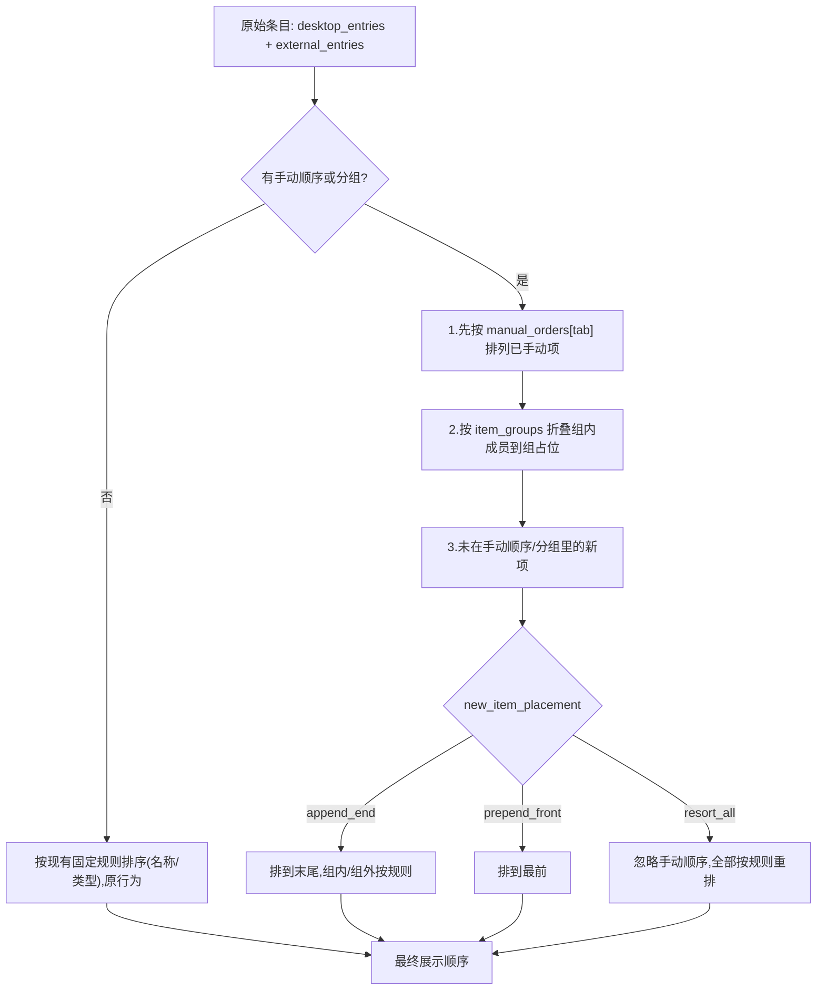

# 标签内图标排序 + 分组 设计文档

状态：阶段一已实现，阶段二（虚拟图标分组）已实现
关联需求：用户希望参考 Windows 开始菜单的「拖动移动 + 分组（小组/文件夹）」体验
当前 schema：5（v4 → v5 迁移已落地，新增图标分组 id 使用 `item-group-...` 前缀）

---

## 1. 目标与非目标

### 目标

1. 在一个标签（items 类型）内，用户可以**拖动图标调整顺序**，顺序被持久化。
2. 在一个标签内，用户可以创建**分组（小组）**，把若干图标归到一个有名字的虚拟文件夹格子里。
3. 拖过顺序之后，**新出现的桌面文件不会打乱手动顺序**；新项的落位行为可在设置里配置。
4. 全程**不移动、不复制、不删除任何真实文件**。排序与分组只是显示层的元数据。

### 非目标

- 不做跨标签拖动排序（跨标签仍走现有「分类规则 / 手动归类」逻辑）。
- 不改普通文件入口面板的整体视觉，只在其内部增加排序/分组能力。
- 不引入真实的文件系统文件夹。分组是虚拟的。

---

## 2. 安全边界（最重要）

与现有 `manual_overrides` / `external_refs` 一致，新增的「顺序」「分组」全部只存 canonical_path 的引用关系：

- 排序：记录每个标签内项目的显示先后。
- 分组：记录"某个 canonical_path 属于某个虚拟组"。

删除分组、清空排序、删除标签，都**只删元数据**，绝不触碰磁盘文件。这一点会在迁移、删除、整理等所有路径上用测试守住。分组拖拽诊断进入应用日志目录 `%LOCALAPPDATA%\DesktopCleaner\logs\`，不在仓库根目录生成临时日志文件。

---

## 3. 数据模型变更（schema 4 → 5）

### 3.1 新增：每标签的手动顺序

在 `Configuration` 增加：

```python
# 显示层排序:key = tab_id, value = 按手动顺序排列的 canonical_path 列表。
# 只记录"被手动拖动过的项";未在列表中的项视为未排序,按规则排在其后。
manual_orders: dict[str, list[str]] = field(default_factory=dict)
```

> 用 canonical_path 而非新 id，复用现有 `canonical_key()` 归一化逻辑，和 `manual_overrides` 保持一致。

### 3.2 新增：分组（小组）

新增数据类 `ItemGroup`：

```python
@dataclass
class ItemGroup:
    id: str               # 新建分组使用 item-group-... 前缀；旧 group-... id 兼容读取
    tab_id: str           # 分组所属标签
    name: str             # 组名,例如"工作""游戏"
    order: int            # 组在标签内的位置
    member_paths: list[str]  # 组内成员的 canonical_path,按组内顺序
```

在 `Configuration` 增加：

```python
item_groups: list[ItemGroup] = field(default_factory=list)
```

### 3.3 新增：新项落位偏好（可配置交互）

在 `DesktopSettings`（或一个新的显示偏好块）增加：

```python
# 手动排序后,新出现的项放在哪里。
# "append_end" 末尾(默认) | "prepend_front" 最前 | "resort_all" 按规则重排全部
new_item_placement: str = "append_end"
```

> 对应你说的"设计一个交互设置"——会在设置中心做成一个下拉框/单选。

### 3.4 序列化与校验

- `to_dict` / `from_dict` 对称补齐 `manual_orders`、`item_groups`、`new_item_placement`。
- `validate_configuration` 增加：
  - `item_groups` 的 `tab_id` 必须存在且是 items 类型标签。
  - 组成员、`manual_orders` 里的 canonical_path 允许"暂时悬空"（文件可能已不在桌面），渲染时过滤即可，不报错——避免外部改动导致配置 corrupt。

---

## 4. 迁移（v4 → v5）

新增 `_migrate_schema_four_to_five()`：

- `manual_orders = {}`
- `item_groups = []`
- `new_item_placement = "append_end"`
- `schema_version = 5`
- 迁移后照例 `validate_configuration` 兜底。

旧配置升级后行为**完全不变**（无手动顺序、无分组），属于纯增量、零破坏迁移。

布局历史快照（`layout-history.json`）只用于面板布局/外观恢复；图标排序与图标分组变化实时保存配置，但不写入布局历史。

---

## 5. 排序与分组算法

`visible_entries_for_active_tab` 之后增加一个「显示编排」步骤 `arrange_entries_for_tab(tab_id, entries, config)`：



关键点：
- **手动项固定**：在 `manual_orders[tab_id]` 里的项严格按该列表顺序。
- **新项不打架**：不在任何手动顺序/分组里的项，按 `new_item_placement` 落位，默认末尾，按固定规则内部排序。
- **分组占位**：一个分组在标签里占一个"格子"（显示组图标/预览 + 组名）；点击后用浮层显示成员。

---

## 6. 交互设计（参考 Windows 开始菜单）

### 6.1 拖动排序（阶段一）

- 在 `ItemGridWidget` 内，按住图标拖动到新位置，实时显示插入指示线。
- 松手后写入 `manual_orders[tab_id]` 并保存配置，不写入布局历史。
- 锁定面板时禁用拖动。

### 6.2 分组（阶段二）

- 像开始菜单一样：**把一个图标拖到另一个图标上 → 创建分组**（弹出"命名分组"内联输入，可留默认名）。
- 拖图标进/出已有分组。
- 分组展开/折叠：单击组打开浮层，浮层中显示成员图标。
- 删除分组：右键组 → "解散分组"（成员回到标签普通区，绝不删文件）。
- 组内只剩 1 个成员时自动解散，不保留空壳或单项目壳。

### 6.3 新项落位设置

设置中心「分类规则」或「面板」页增加一项：

```
新文件位置：  ( ) 放在末尾   ( ) 放在最前   ( ) 每次按规则重排
```

---

## 7. 受影响的代码

| 模块 | 改动 |
|------|------|
| `domain/models.py` | 新增 `ItemGroup`，`Configuration` 增字段，to/from_dict，校验 |
| `persistence/migration.py` | 新增 v4→v5 迁移，bump 当前 schema 到 5 |
| `domain/workspace.py` | 新增 `reorder_item`、`create_group`、`add_to_group`、`remove_from_group`、`dissolve_group`、`set_new_item_placement` |
| `application.py` | `arrange_entries_for_tab`，把编排结果喂给 `item_grid` |
| `ui/item_grid.py` | 图标网格、拖动排序入口、分组信号入口 |
| `ui/item_grouping.py` | 分组渲染数据与拖拽诊断日志辅助 |
| `ui/group_folder_popup.py` | 分组浮层、成员显示、成员拖出 |
| `ui/settings_window.py` | 新项落位设置项 |
| `tests/` | 数据模型、迁移、排序算法、拖动交互、分组、"不碰文件"安全测试 |

---

## 8. 分期建议

- **阶段一（已实现）**：数据模型 + 迁移 + 标签内拖动排序 + 新项落位设置。先把"拖了不乱"这个核心痛点解决。
- **阶段二（已实现）**：分组（小组/文件夹），含创建、拖入拖出、浮层展开、解散。

阶段一可独立发布，风险小；阶段二再单独评审交互细节。

### 阶段二落地清单（已实现）

- `domain/workspace.py`：`create_item_group` / `add_items_to_group` / `remove_items_from_group` / `rename_item_group` / `dissolve_item_group`，成员存 canonical_key，自动清理空组，仅 items 标签可建组，全程不碰真实文件。
- `application.py`：`group_blocks_for_tab` 构建渲染区块（按 `order`，成员过滤为可见项）；分组信号处理器（建组/加入/移出/重命名/解散）实时持久化但不进布局历史，只刷新相关面板。
- `ui/item_grid.py`：分组以单个虚拟文件夹格子渲染；拖到另一图标中心建组，拖到已有分组格子加入，成员从浮层拖出则移出；锁定面板禁用。
- `ui/group_folder_popup.py`：分组浮层负责显示成员、成员拖出、重命名和解散入口。
- `ui/item_grouping.py`：提供 `GroupBlock`、`DisplaySlot` 和正式应用日志下的拖拽调试输出。
- 测试：workspace 分组增删改 + 文件不被触碰；item_grid 分组渲染、拖拽建组、拖入已有组；应用层只刷新相关面板。

### 阶段一落地清单

- `domain/models.py`：`ItemGroup` + `Configuration.{manual_orders,item_groups,new_item_placement}`，序列化/校验（gated on schema≥5），默认期望 schema 升到 5。
- `domain/defaults.py`：默认 `schema_version = 5`。
- `persistence/migration.py`：`CURRENT_SCHEMA_VERSION = 5`，新增 `_migrate_schema_four_to_five`，接入 v2/v3/v4/legacy 全链路。
- `persistence/layout_history.py`：保留面板布局/外观历史能力；图标排序和图标分组不写入布局历史。
- `domain/workspace.py`：`reorder_tab_items`、`clear_manual_order`、`set_new_item_placement`；`delete_tab` 同步清理排序/分组元数据（不碰文件）。
- `application.py`：`arrange_entries_for_tab` 应用手动顺序 + 落位策略，接入 `refresh()`；`_on_items_reordered` 持久化但不进布局历史（避免刷屏）。
- `ui/item_grid.py`：QDrag 标签内拖动排序 + `items_reordered` 信号，锁定面板禁用。
- `ui/settings_window.py`：外观页「新文件位置」全局下拉。
- 测试：models / migration / layout_history / workspace / arrange / grid 拖动与"不碰文件"安全性，全量 339 通过。

---

## 9. 已确认决策（评审定稿）

1. **分组视觉**：采用虚拟文件夹格子 + 浮层展开，不在主网格里平铺成员区块。
2. **分组不跨标签**：组归属单个标签，不支持跨标签。
3. **新项落位设置为全局**：`new_item_placement` 作用于所有标签，不做每标签粒度。
4. **图标分组不进入布局历史**：排序/分组用于当前显示状态，实时保存，不提供历史回退。

### 对设计的影响

- 渲染：标签内直接混排普通图标与分组文件夹格子；分组文件夹点击后展开浮层，仍支持解散分组。
- `item_groups` 的 `order` 决定分组格子在标签内的先后；未分组项位置由 `manual_orders` 与 `new_item_placement` 决定。
- 迁移层只补齐主配置中的排序/分组字段；历史恢复仍面向面板布局与外观。

---

## 10. 测试要点（先列，后用 TDD 实现）

- 迁移：v4 配置升级到 v5，字段默认值正确，行为不变。
- 排序：手动顺序固定；新增文件按 `append_end/prepend_front/resort_all` 落位正确。
- 分组：创建/拖入/拖出/解散后，`item_groups` 与渲染一致。
- 安全：reorder / 分组 / 解散 / 删除标签，真实文件均不被移动或删除（用临时文件断言文件仍在、内容不变）。
- 边界：手动顺序/分组里引用的文件已不存在时，渲染自动过滤、不崩溃、不报 corrupt。
